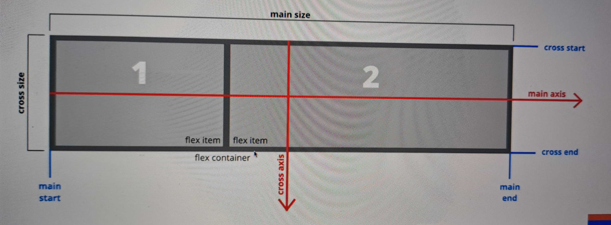

### CSS Units: Absolute

1. cm : Centimeters
2. mm : Millimeters
3. in : Inches
4. px : Pixels (1px = 1/96th of 1in)
5. pt : Points (1pt = 1/72 of 1in)
6. pc : Picas picas (1pc = 12pt)

### CSS Unit: Relative

1. %   : To parent element
2. em  : To font-size of parent element
3. rem : To font size of the root element
4. vw  : To 1% of viewport width
5. vh  : To 1% of viewport height

#### Viewport is area within the browser

* Viewport is sliced into 100 pieces, despite of browser window size
* vh is viewport height and its max value of 100vh, divided into 100 slices
* vw is viewport width and its maximum value is 100vw, divided into 100 slices

### CSS Positioning

* Static    | Not effected by tblr (top, bottom, left, right) properties/values
* Relative  | tblr values cause element to be moved from its normal position
* Absolute  | Positioned relative to its parent element that is positioned "relative"
* Fixed     | Positioned relative to the viewport
* Sticky    | Positioned based on the scroll position

### How to achieve responsive design

* Set the viewport / scale
* Use fluid widths as opposed to fixed
* Media queries - Different CSS styling for different screen sizes
* Rem units over px
* Mobile first method

### Flexbox

* It was introduced in CSS3
* Modern layout mode in CSS3
* `flex` is a value for the **display** property
* replaces floats and is much more elegant to work with
* Aligns items both horizontal (row) and vertical (column)
* Flex items can be re-ordered via CSS
* `display: flex;` creates a **flex container**
* All direct child elements are **flex items**
* `justify-content`: align along the main axis (horizontal)
* `align-items`: align items along the cross axis (vertical)
* `align-content`: align when extra space in cross axis

